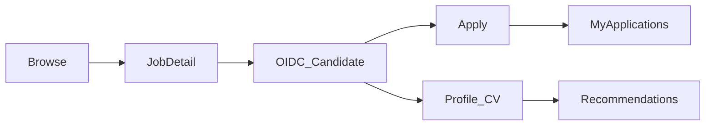
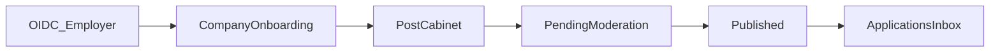

# Ingress Job — Customer Journey

Bu sənəd Ingress Job saytında iki əsas personajın səyahətini təsvir edir: **namizəd** (iş axtaran) və **işəgötürən**. Məqsəd rehber və komanda üçün rəsmi səyahət xəritəsi vermək və kritik sürtünmə nöqtələrinin harada olduğunu göstərməkdir.

**Ödəniş yoxdur** bu versiyada. Giriş Ingress Academy OIDC ilədir.

---

## Personajlar

| Personaj | Rol (OIDC) | Əsas məqsəd |
|----------|------------|-------------|
| Namizəd | `job:candidate` | Elan tapmaq, müraciət etmək, CV/matching ilə irəliləmək |
| İşəgötürən | `job:employer` | Şirkət profili, elan yazmaq, müraciətləri idarə etmək |

Əməkdaş (`job:staff`) moderasiya üçün əl ilə verilir; bu sənədin əsas scope-una daxil deyil.

---

## Namizəd səyahəti

### 1. Awareness — kəşf

| | |
|--|--|
| **Məqsəd** | Saytı və elanları görmək, hesab olmadan |
| **Ekranlar** | `/` (az), `/en`, `/ru`; `/companies`; `/trends` |
| **Davranış** | Axtarış, filterlər, şirkət kataloqu, skill trends |
| **Ağrı** | Şəhər filteri yoxdur; filterlər URL-də saxlanmır |
| **Success** | İstənilən elanın detal səhifəsinə klik |

### 2. Consideration — elan detal

| | |
|--|--|
| **Məqsəd** | Vakansiyanı oxumaq, müraciətə qərar vermək |
| **Ekran** | `/jobs/[id]` |
| **Davranış** | Tam mətn görünür; **orijinal URL və müraciət** qonağa bağlıdır |
| **Ağrı** | Toplanmış (xarici) elanlarda sayt daxili forma yoxdur — sonra redirect |
| **Success** | “Müraciət” / qeydiyyat CTA-ya klik |

### 3. Registration — namizəd girişi

| | |
|--|--|
| **Məqsəd** | Academy hesabı ilə namizəd rolunu almaq |
| **Axın** | Qeydiyyat → Müraciət edən → OIDC (`job_candidate`) → callback |
| **Ekranlar** | `RegisterChoice`, `/api/auth/login` |
| **Ağrı** | SSO xətası; rol seçimi başa düşülməyə bilər |
| **Success** | `me.candidate === true`, geri dönüş URL-i |

### 4. Apply — müraciət

| | |
|--|--|
| **Məqsəd** | Elana müraciət göndərmək |
| **Onsite elan** | Forma: mesaj, telefon, e-poçt, əlavə suallar, CV → `POST /api/v1/jobs/{id}/apply` |
| **Xarici elan** | Qeydiyyatdan sonra orijinal URL / redirect |
| **Ağrı** | Kontakt profil boşdursa forma əlavə sürtünmə; dublikat → 409 |
| **Success** | Onsite: status `submitted`; xarici: mənbəyə keçid |

### 5. Profile / CV

| | |
|--|--|
| **Məqsəd** | Kontakt + tam CV profilini doldurmaq (matching üçün) |
| **Ekranlar** | `/profile` (ad, telefon, e-poçt, razılıqlar); `/profile/review` (CV yüklə / əl ilə) |
| **Ağrı** *(əvvəl)* | CV review account menyusunda görünmürdü; iki səhifə əlaqəsiz görünürdü |
| **Düzəliş** | Account menyuda CV linki; qarşılıqlı CTA-lar |
| **Success** | CV profili `confirmed`; matching razılığı aktiv |

### 6. Retention — qalmaq

| | |
|--|--|
| **Məqsəd** | Status izləmək, tövsiyə almaq, yenidən gəlmək |
| **Ekranlar** | `/applications`; `/me/recommendations`; `/settings/emails`; `/notifications` |
| **Ağrı** | AI/matching bayraqlar sönülü olanda boş görünə bilər |
| **Success** | Müraciət status dəyişikliyi bildirişi; digest / yüksək uyğunluq e-poçtu |

**Namizəd funnell metrikləri (tövsiyə):** qonaq → detal → login → ilk müraciət; login → CV confirmed; confirmed → recommendations baxışı.

---

## İşəgötürən səyahəti

### 1. Registration — işəgötürən girişi

| | |
|--|--|
| **Məqsəd** | Academy ilə `job_employer` almaq |
| **Axın** | Qeydiyyat → Elan yerləşdirirəm → OIDC → callback |
| **Success** | `me.employer === true` |

### 2. Onboarding — şirkət profili

| | |
|--|--|
| **Məqsəd** | Elan yazmazdan əvvəl şirkət adı, şəhər, qısa təsvir |
| **Ekran** | `/company` (yalnız ilk tamamlama / gate) |
| **Gate** | `needs_company_profile` → `/post` və `/admin` `/company`-ə yönləndirilir |
| **Ağrı** *(əvvəl)* | Tamamlandıqdan sonra da `/company` redaktə kimi açıq qalırdı; `/profile` ilə təkrarlanırdı |
| **Düzəliş** | Tam profil ilə `/company` → `/profile` (şirkət bloku); davamlı redaktə orada |
| **Success** | `needs_company_profile === false`, `/post`-a keçid |

### 3. Post — elan yaratmaq

| | |
|--|--|
| **Məqsəd** | Vakansiya yazmaq və saxlamaq |
| **Ekran** | `/post` kabinet — “Yeni elan” tabı |
| **Nəticə** | İşəgötürən üçün status `pending`; əməkdaş üçün dərhal `published` |
| **Success** | Elan “Elanlarım” siyahısında görünür |

### 4. Moderation wait

| | |
|--|--|
| **Məqsəd** | Təsdiq gözləmək |
| **Davranış** | Staff təsdiq / rədd; rədd səbəbi görünür, düzəlib yenidən göndərilə bilər |
| **Ağrı** | Gözləmə müddəti; dərcdən sonra əhəmiyyətli redaktə yenidən `pending` |
| **Success** | Status `published`, ictimai siyahıda |

### 5. Applications — müraciətlər

| | |
|--|--|
| **Məqsəd** | Namizəd müraciətlərini görmək və qərar vermək |
| **Ekran** | `/post` — ümumi **Müraciətlər** tabı + hər elanın altında siyahı |
| **Əməliyyatlar** | `seen` / `rejected` (+ səbəb); CV yükləmə |
| **Ağrı** *(əvvəl)* | Yalnız elan kartının içində — cross-job inbox yox idi |
| **Düzəliş** | Kabinetdə ümumi Müraciətlər tabı (`GET /api/v1/cabinet/applications`) |
| **Success** | İlk müraciətə baxıldı / rədd edildi |

### 6. Retention

| | |
|--|--|
| **Məqsəd** | Elanları idarə etmək, bildiriş almaq |
| **Ekranlar** | `/notifications` (`application_new`); `/profile` şirkət bloku; elanı bağlama |
| **Success** | Yeni müraciət bildirişi oxundu; aktiv dərc olunmuş elan saxlanılır |

**İşəgötürən funnell metrikləri (tövsiyə):** employer login → company complete → ilk elan → published → ilk application decision.

---

## As-is → to-be (bu iterasiya)

| Boşluq | As-is | To-be |
|--------|-------|-------|
| CV discoverability | Account menyuda yox | Namizəd menyusunda “CV profilini yoxla” |
| Profil parçaları | Zəif link | `/profile` ↔ `/profile/review` aydın CTA |
| Employer applications | Yalnız per-ad | `/post` ümumi Müraciətlər tabı |
| Company edit dual | `/company` + `/profile` | `/company` onboarding; sonra `/profile` |

---

## Növbəti backlog (bu sənədə daxil deyil)

- Şəhər filteri; filter state URL-də
- Saved / favorited jobs
- Talent search (recruiter visibility UI)
- Public `/companies/[slug]` ilə `company_profiles` birləşməsi
- Application status genişlənməsi (interview, hire)
- Staff moderasiya journey sənədi

---

## Əlaqəli kod

- Namizəd UI: `frontend/components/{home,job-detail,account-bar,profile-form,profile-review,my-applications,recommendations}.js`
- İşəgötürən UI: `frontend/components/{company-form,cabinet,post-page,application-list}.js`
- Auth / gate: `frontend/middleware.js`, `api/app/account.py`
- Arxitektura: [`.cursor/context/architecture.md`](../.cursor/context/architecture.md)
